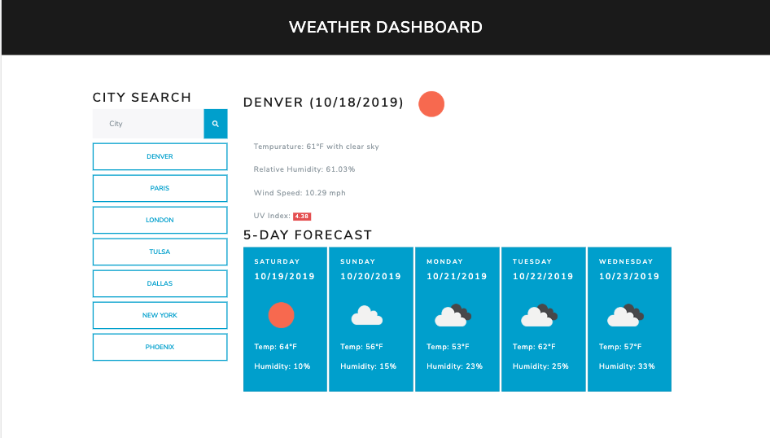

# weather-dashboard

Weather dashboard application with search functionality to find current weather conditions and the future weather outlook for multiple cities.

# visuals

# usage

A weather dashboard application with search functionality to dispay current weather conditions and the 5-day weather forecast for multiple cities. Seach history is available on the left side of the dashboard. A button for each city in the search history allows you to quickly view current and forecast weather for each city.

Application makes use of the OpenWeatherMap API. An alert warning banner appears to inform user if their search city input did not match a city in the API. The banner is customized with the name of the invalid search city name. Numbers are removed from search entries to avoid an API match on cityCode. An alert warning banner with an example of valid search input appears if the search criteria is numbers. If the search input is letters and numbers then the numbers are removed and the API call is made with the remaining letter characters. Again, if the resulting city name is not valid then an alert warning banner informs the user.

UI makes use of bootswatch Lux theme.

### Current weather features

.*City
.*Date
.*Icon image (visual representation of weather conditions)
.*Temperature
.*Humidity
.*Wind speed
.\*UV index

### Forecast weather features

.*Day of the week
.*Date
.*Icon image (visual representation of weather conditions)
.*High tempurature for the day
.\*Humidity

# Link to Project on Github

[weather-dashboard](https://eric-gustafson1.github.io/day-planner/))
